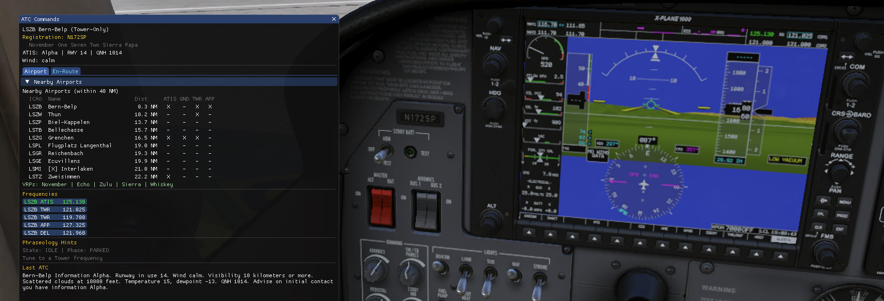

# Welly's ATC — AI Voice ATC for X-Plane 12



> **Triple-backend X-Plane 12 ATC plugin: local inference, OpenAI Cloud, or Mistral Cloud — your choice.**
>
> - **Local (Apple Silicon, default)** — `whisper.cpp` (Metal) + `llama.cpp`
>   (Metal) + Piper TTS, fully offline once the models are downloaded.
>   No daemons, no helper apps, no API keys.
> - **OpenAI Cloud (any Mac)** — Whisper API + Chat Completions +
>   TTS API. Bring your own API key (stored in the macOS Keychain).
> - **Mistral Cloud (any Mac)** — Voxtral STT + Mistral Chat
>   Completions + Voxtral TTS. Bring your own API key (separate
>   Keychain entry so OpenAI and Mistral keys coexist). Cheaper per
>   token than OpenAI; the only mode where ATIS speaks German natively
>   without a US accent (Voxtral TTS is multilingual).
>
> The plugin ships as a **universal binary**: the arm64 slice carries
> all three backends, the x86_64 slice is cloud-only (OpenAI or
> Mistral). The user picks the mode at runtime in Settings.
>
> The spike-phase architecture and per-backend measurements are archived in
> [`docs/architecture-analysis.md`](docs/architecture-analysis.md) and
> [`spikes/spike_e2e/RESULTS.md`](spikes/spike_e2e/RESULTS.md).
>
> **Measured pipeline latency** (warm, M4, local inference, end-to-end spike):
> STT 321 ms · LM 634 ms · TTS 200 ms · **total ≈ 1.16 s per request** —
> well under the 3 s acceptance target with > 1.8 s of headroom for the
> M4-vs-M1 generational gap and the plugin's main-thread / Core Audio
> overhead. Cloud modes (OpenAI / Mistral) are typically slower: 2–3 s
> warm round-trip dominated by API latency. M1 local re-validation:
> pending real-flight smoke test.

---

AI-powered ATC voice communication plugin for X-Plane 12 VFR flights.

Talk to ATC using your microphone via push-to-talk. The plugin
transcribes your speech (locally with whisper.cpp, via the OpenAI
Whisper API, or via Mistral's Voxtral STT — your pick), interprets
your intent through a rule-based ATC state machine — with a
low-confidence fallback to a local Llama 3.2 3B classifier, OpenAI's
`gpt-4o-mini`, or Mistral Small, again your pick — and plays back ATC
responses synthesised locally with Piper or via OpenAI's / Mistral's
TTS API.

## Table of Contents

- [Features](#features)
- [Hardware Requirements](#hardware-requirements)
- [Software Requirements](#software-requirements)
- [Quick Start](#quick-start-pre-built-release)
- [Backend Modes](#backend-modes)
- [Radio glitch recovery (TTS-failure guard)](#radio-glitch-recovery-tts-failure-guard)
- [Build From Source](#build-from-source)
- [Local Inference Models](#local-inference-models)
- [Configuration](#configuration)
- [Usage](#usage)
- [Make Targets](#make-targets)
- [Known Limitations](#known-limitations)
- [FAQ](#faq)
- [Project Structure](#project-structure)
- [Third-Party Dependencies](#third-party-dependencies)
- [Development Workflow](#development-workflow)
- [License](#license)

## Features

- **Push-to-Talk** — bound via X-Plane command binding (keyboard or joystick)
- **Triple-backend inference** — pick **Local** (Apple Silicon only),
  **OpenAI Cloud**, or **Mistral Cloud** (both any Mac, BYO API key)
  in the Settings tab. Switch at runtime, no plugin restart. Every
  inference call is tagged with `[STT-LOCAL]` / `[STT-OPENAI]` /
  `[STT-MISTRAL]` (and equivalent for LM/TTS) in X-Plane's `Log.txt`
  so you can audit which side served each request.
- **Local Speech-to-Text** — `whisper.cpp` `small.en-q5_1`, Metal-accelerated
- **Local LLM** — `llama.cpp` running Llama 3.2 3B Instruct (Q4_K_M),
  Metal-accelerated; used for intent disambiguation when the rule-based
  parser is uncertain. Repair output is digit-validated to suppress
  hallucinated runways or frequencies.
- **Local Text-to-Speech** — Piper, neutral US accent (`en_US-lessac-medium`),
  CPU + onnxruntime
- **OpenAI Cloud option** — `whisper-1` for STT, `gpt-4o-mini` for the
  intent classifier (JSON-mode for constrained output), `tts-1` with
  six selectable voices (`alloy/echo/fable/onyx/nova/shimmer`; `onyx`
  is closest to real ATC). Key stored in the macOS Keychain via
  `Security.framework`, never in `settings.json`, never logged in full
  (only the last 4 characters appear in audit lines).
- **Mistral Cloud option** — `voxtral-mini-2507` for STT (with
  `context_bias[]` airport biasing), `mistral-small-latest` for the
  intent classifier (JSON-mode), `voxtral-mini-tts-2603` with 30
  preset voices across British, American and French speakers in 7-9
  emotional registers (default per role: `gb_oliver_neutral` for ATIS,
  `en_paul_confident` for Tower, `en_paul_neutral` for Ground —
  British neutral reads closest to ICAO broadcast cadence). Separate
  Keychain entry so the OpenAI and Mistral keys coexist; switching
  modes never requires re-pasting.
- **ATC State Machine** — VFR phraseology for towered and non-towered airports
- **Flight Phase Detection** — context-aware guards prevent unrealistic ATC
  interactions based on aircraft state (parked, taxi, airborne, etc.)
- **Live Traffic Awareness (v2.1) + Landing Sequencing (v2.2)** —
  provider-agnostic `sim/cockpit2/tcas/targets/...` reader feeding a
  2 Hz `TrafficContext` snapshot. EU-phraseology en-route advisories
  with voice acknowledgement (`"Traffic in sight"` / `"Negative
  contact"` / `"Looking"`) on a side-channel that does not interfere
  with the main ATC flow. **v2.2 adds VFR landing sequencing** —
  *"number N, follow the [type] on left base, cleared to land runway X"*
  when other traffic is on Final or Pattern, *"continue approach,
  traffic on the runway"* when the active runway is blocked, and an
  unsolicited Tower-issued go-around within 1 NM of the threshold when
  the runway stays occupied. Master switch `traffic_features_enabled`
  in Settings turns the whole subsystem off in one click.
- **ATIS Generation** — automatic ATIS broadcasts from live sim weather
  data, on COM1 *or* COM2 (active or standby). Aborts mid-broadcast if
  the pilot retunes the COM that's playing.
- **Radio discipline coaching** — ATC issues a polite reminder when the pilot
  uses inappropriate language, escalating on repeats
- **Phraseology Hints** — context-aware cheat sheet with full ICAO phraseology
  on hover
- **Cross-Country Support** — full VFR departure, en-route frequency change,
  and inbound flow between airports. Approach controller proactively
  hands off to Tower with the destination frequency.
- **Aircraft registration display** — pilot callsign linked to the
  cockpit's actual tail number read from X-Plane
- **"Disregard" recovery** — flow-aware reset (PATTERN_ENTRY when
  airborne near the home airport, EN_ROUTE in transit, IDLE on the
  ground)
- **TTS-failure recovery (radio glitch guard)** — when speech synthesis
  or playback fails (OpenAI timeout, dropped network, Piper IO error),
  the plugin does not strand the pilot in a state the tower never
  actually announced. A snapshot of the ATC state machine is taken
  before each pilot transmission; on failure the plugin plays a short
  in-process squelch burst on the active COM and either rolls the
  state back ("re-issue your call") or — if an auto-correction has
  moved things on in the meantime — keeps the unsent clearance
  accessible via `REQUEST_REPEAT` ("Wiederholen Sie" / "Say again").
  See [Radio glitch recovery](#radio-glitch-recovery-tts-failure-guard).
- **Radio Power Awareness** — ATC panel disables when COM radio has no
  electrical power, with optional bypass for exotic aircraft
- **In-plugin model downloader** — first launch surfaces an ImGui dialog,
  HTTPS-resumable downloads from HuggingFace, SHA256-verified before use
- **ImGui UI** — in-sim ATC panel with frequency management, phraseology
  hints, transcript history, a Models tab for download / re-verify, and
  an optional Traffic tab (debug) listing the 10 nearest aircraft

## Hardware Requirements

The plugin ships as a **universal binary** — one `.xpl`, two slices.
X-Plane automatically loads whichever matches the host.

| Mac | Slice loaded | Backends available |
|---|---|---|
| Apple Silicon (M1 / M2 / M3 / M4) | `arm64` | **Local**, **OpenAI Cloud**, *or* **Mistral Cloud** |
| Intel (x86_64) | `x86_64` | **Cloud only** — **OpenAI** or **Mistral** (local inference needs Metal + Apple Silicon) |

| Resource | Local mode | OpenAI / Mistral Cloud mode |
|---|---|---|
| RAM | 32 GB recommended (X-Plane 12 + ~3 GB headroom for the inference stack) | 16 GB (no model in RAM — calls are stateless HTTP requests) |
| Disk | ~2.5 GB free for the bundled models | ~50 MB for the plugin bundle (no models downloaded) |
| GPU | Any Metal-capable GPU on the same Apple Silicon chip | not used |
| Network | not used at runtime (one-time model download from HuggingFace) | required — every PTT release triggers HTTPS calls to `api.openai.com` or `api.mistral.ai` |

Both cloud modes cost money per request (STT + LM + TTS APIs).
Mistral is typically cheaper per token than OpenAI (`mistral-small`
≈ 33 % cheaper input / 50 % cheaper output than `gpt-4o-mini`). STT
and TTS are roughly at price parity. Latency for both clouds is
typically 2–3 s warm vs. 1–1.5 s warm for local inference. Plan
accordingly.

## Software Requirements

| Item | Requirement |
|---|---|
| macOS | **13.3 or later** (onnxruntime 1.22.0 requires this on the arm64 slice; the x86_64 slice inherits the same deployment target so the lipo'd binary stays consistent) |
| X-Plane | X-Plane 12 (12.0 or later) |
| OpenAI / Mistral account | Only if you want to use a cloud mode — needs an API key with billing enabled for the respective provider. Local mode has no cloud dependency. |
| For building from source | CMake 3.26+, Homebrew LLVM (`brew install llvm`), Xcode Command Line Tools |

## Quick Start (pre-built release)

1. Download `xp_wellys_atc-vX.Y.Z.zip` from the GitHub Releases page.
   The `.xpl` inside is a universal binary covering arm64 and x86_64.
2. Extract into `X-Plane 12/Resources/plugins/`. Result:
   ```
   X-Plane 12/Resources/plugins/xp_wellys_atc/
     ├── mac_x64/
     │     ├── xp_wellys_atc.xpl       (universal: arm64 + x86_64)
     │     ├── libpiper.dylib          (used by arm64 slice only)
     │     ├── libonnxruntime.1.22.0.dylib
     │     └── libonnxruntime.dylib
     ├── Resources/
     │     └── espeak-ng-data/   (~19 MB, used by arm64 slice only)
     └── data/
           └── (ATC profile bundles, prompt templates, VRP database, etc.)
   ```
3. Launch X-Plane. Open the plugin window via *Plugins → Welly's ATC*.
4. **Pick your backend** in the **Settings** tab:
   - **Local** (Apple Silicon, default): the **Models** tab shows three
     rows in red. Click **Download all missing** — the plugin pulls
     ~2.0 GB from HuggingFace over HTTPS. Resumable; cancellable;
     SHA256-verified after each file. Once all rows show **Ready**
     (green), the PTT-disabled banner on the Status tab disappears.
   - **OpenAI Cloud** (any Mac): paste your OpenAI API key into the
     **OpenAI API Key** field in Settings (use the `[Paste]` button —
     Cmd+V inside X-Plane's ImGui context is unreliable). Click
     **Save Key**. The key is stored in the macOS Keychain under
     service `com.xp_wellys_atc.openai`. PTT is enabled immediately;
     no model download.
   - **Mistral Cloud** (any Mac): paste your Mistral API key into the
     **Mistral API key** field in Settings (same `[Paste]` button
     pattern). Click **Save Key##mistral**. The key is stored under a
     separate Keychain entry `com.xp_wellys_atc.mistral`, so the
     OpenAI key (if any) stays untouched and you can flip-flop
     between providers without re-pasting. PTT is enabled
     immediately; the three voice slots default to ICAO-friendly
     British / American Voxtral preset voices and can be changed in
     the same panel.
5. Fly. The Status tab's banner will tell you which mode is active and
   `Log.txt` carries a one-line `BACKEND MODE: ...` banner on every
   load so you can prove after the fact which side served the session.

## Backend Modes

You can switch at any time in the Settings tab — the plugin tears
down the active inference stack and brings up another one, no X-Plane
restart. Source-level invariant: each backend family lives in its
own set of `.cpp` files and the three families share no headers and
no code path. The local backends (`whisper_stt.cpp`, `llama_lm.cpp`,
`piper_tts.cpp`) contain no `#include` of any cloud client and zero
`curl_easy_perform` calls; the OpenAI clients (`openai_stt.cpp`,
`openai_lm.cpp`, `openai_tts.cpp`) contain no `#include` of
`whisper.h` / `llama.h` / `piper.h` and none of the Mistral
endpoints; the Mistral clients (`mistral_stt.cpp`, `mistral_lm.cpp`,
`mistral_tts.cpp`) carry neither local headers nor `api.openai.com`.
So in any one mode no code path can call into the other two —
verified at compile time and grep-time by
`tests/test_audit_logging.cpp`.

Auditing which mode served a request: grep `Log.txt`.

| Tag in `Log.txt` | What it means |
|---|---|
| `[xp_wellys_atc] BACKEND MODE: LOCAL ...` | Loader brought up the local pipeline. |
| `[xp_wellys_atc] BACKEND MODE: OPENAI (api.openai.com) ...` | Loader brought up the OpenAI cloud pipeline. |
| `[xp_wellys_atc] BACKEND MODE: MISTRAL (api.mistral.ai) ...` | Loader brought up the Mistral cloud pipeline. |
| `[STT-LOCAL] / [LM-LOCAL] / [TTS-LOCAL]` | Per-call audit for each local inference. |
| `[STT-OPENAI] / [LM-OPENAI] / [TTS-OPENAI]` | Per-call audit for each OpenAI cloud inference. API key is truncated to its last 4 chars (`sk-...ABCD`). |
| `[STT-MISTRAL] / [LM-MISTRAL] / [TTS-MISTRAL]` | Per-call audit for each Mistral cloud inference. API key is truncated to its last 4 chars (`...ABCD`; no `sk-` prefix — Mistral keys are not OpenAI-formatted). |

## Radio glitch recovery (TTS-failure guard)

The pilot-driven TTS path is wrapped in a snapshot/revert guard so a
synthesis or playback failure (OpenAI `curl error: Timeout`, transient
5xx, dropped Wi-Fi, local Piper IO error, audio bus glitch) cannot
leave the ATC state machine ahead of what the pilot actually heard.
The mechanic is uniform across both backend modes — the same code path
handles Local and Cloud.

How it works:

- Before each pilot transmission goes into `atc_state_machine::process()`,
  the plugin captures an opaque snapshot of the full machine state
  (current state, transition history, runway lock, readback flag,
  departure type, last clearance text, last tower utterance). A
  monotonic generation counter is bumped on every semantic mutation —
  per-frame heartbeats (timestamps, auto-correction timers) are not
  counted so they cannot invalidate the snapshot.
- On TTS success: nothing else happens. The state advances as before,
  the pilot hears the reply, the snapshot is dropped.
- On TTS failure: a short squelch burst (~350 ms pink noise plus a
  click) is played on the active COM. The burst is generated
  in-process from a deterministic seeded PRNG — it cannot fail in the
  same way the TTS call just did, and it works in VR or under the
  IFR-hood when the panel is not in view. Then one of two branches
  runs:
  - **Restore branch** — no third party mutated the state machine in
    the meantime. The pre-transmission snapshot is restored, the
    transcript panel shows a dim-amber System entry `-- Funkstörung —
    bitte den Funkspruch wiederholen --`, and the pilot can re-issue
    the same call cleanly.
  - **Stale branch** — a later auto-correction (or another callback)
    already advanced the generation counter past the snapshot's
    expected value. Rolling back would silently undo that legitimate
    transition, so the rollback is rejected. The clearance text the
    pilot never heard is still parked in `last_tower_response_text_`,
    a System entry `-- Funkstörung — sagen Sie 'Wiederholen Sie' für
    die verpasste Anweisung --` steers the pilot toward the
    `REQUEST_REPEAT` path, which replays the missed clearance
    verbatim. After the replay the pilot reads back normally and the
    state machine re-synchronises.

ATIS broadcasts, traffic advisories, and the unsolicited go-around
prompt use the unguarded TTS path — they are stateless render-only
events. If a tick drops, the next tick simply tries again.

Implementation:

- `src/atc/atc_state_machine.{hpp,cpp}` — `AtcStateSnapshot`,
  `capture_snapshot()`, `current_gen()`, `restore_snapshot_if_gen()`,
  generation-counter discipline (banner comment in the cpp file
  spells out which fields bump gen and which are heartbeat-only).
- `src/atc/atc_session.cpp` — `speak_response_guarded()` wraps the
  `engine::process_transcript` callback for state-mutating tower
  replies.
- `src/audio/audio_player.{hpp,cpp}` — `play_squelch_burst(com)`, no
  WAV asset, no network.
- `tests/test_state_revert_guard.cpp` — four behavioural cases:
  snapshot+restore round-trip, generation monotonicity, stale-branch
  rejection, `REQUEST_REPEAT`-after-stale recovery.

## Build From Source

```sh
git clone --recurse-submodules <repo-url>
cd xp_welly_llm_atc
make setup     # X-Plane SDK, Dear ImGui, nlohmann/json, Catch2, spike submodules
make build     # Universal Release build → build/xp_wellys_atc.xpl (arm64
               # with all three backends + x86_64 cloud-only, lipo'd into
               # one .xpl). This is now the only build target — there is
               # no arm64-only fast-path anymore.
make install   # Code-sign + install to X-Plane plugins directory
```

`make build` runs CMake twice (arm64 with `XPWELLYS_USE_LOCAL_INFERENCE=ON`
in `build-arm64/`, x86_64 with the same flag `OFF` in `build-x86_64/`)
and `lipo`-merges the two `.xpl`s into one universal binary. Build
time is roughly double a single-arch build; that is the deliberate
trade-off so dev and release artifacts are byte-for-byte identical in
shape. For tag-driven release builds pass `RELEASE_FLAG=-DRELEASE=ON`
(`make release-build` does this for you — embeds the version from
`VERSION.txt`).

The build downloads onnxruntime's prebuilt arm64 dylib (≈ 33 MB) into
`spikes/spike_piper/third_party/piper1-gpl/libpiper/lib/` on first
configure. After that everything is local. The x86_64 slice has no
onnxruntime / Piper / whisper / llama dependency at all — it links
only against libcurl + the system frameworks (Security, AudioToolbox,
etc.) and the OpenAI clients.

## Local Inference Models

The plugin ships **without** the model files (~2.0 GB combined). They live
under `<plugin>/Resources/models/` and are downloaded on first launch via
the **Models** tab. Each download is HTTPS, resumable (`Range` header),
streamed directly to the install volume (no temp roundtrip via the system
disk — important for users running X-Plane on an external SSD), and
SHA256-verified before being renamed from `<file>.part` to its final
filename.

### Manual fallback (restrictive networks)

If the in-plugin downloader cannot reach HuggingFace (corporate proxy,
captive portal, etc.), download these files manually and drop them into
`<plugin>/Resources/models/`. The plugin re-verifies on the next launch
and loads them automatically if the hashes match.

| Model | Lang | Size | SHA256 | URL |
|---|---|---:|---|---|
| `ggml-small.en-q5_1.bin` | en | 181 MB | `bfdff4894dcb76bbf647d56263ea2a96645423f1669176f4844a1bf8e478ad30` | [`huggingface.co/ggerganov/whisper.cpp/resolve/main/ggml-small.en-q5_1.bin`](https://huggingface.co/ggerganov/whisper.cpp/resolve/main/ggml-small.en-q5_1.bin) |
| `ggml-small-q5_1.bin` | de (multilingual) | 181 MB | `ae85e4a935d7a567bd102fe55afc16bb595bdb618e11b2fc7591bc08120411bb` | [`huggingface.co/ggerganov/whisper.cpp/resolve/main/ggml-small-q5_1.bin`](https://huggingface.co/ggerganov/whisper.cpp/resolve/main/ggml-small-q5_1.bin) |
| `Llama-3.2-3B-Instruct-Q4_K_M.gguf` | — | 1.88 GB | `6c1a2b41161032677be168d354123594c0e6e67d2b9227c84f296ad037c728ff` | [`huggingface.co/bartowski/Llama-3.2-3B-Instruct-GGUF/resolve/main/Llama-3.2-3B-Instruct-Q4_K_M.gguf`](https://huggingface.co/bartowski/Llama-3.2-3B-Instruct-GGUF/resolve/main/Llama-3.2-3B-Instruct-Q4_K_M.gguf) |
| `en_US-lessac-medium.onnx` | en | 60 MB | `5efe09e69902187827af646e1a6e9d269dee769f9877d17b16b1b46eeaaf019f` | [`huggingface.co/rhasspy/piper-voices/resolve/main/en/en_US/lessac/medium/en_US-lessac-medium.onnx`](https://huggingface.co/rhasspy/piper-voices/resolve/main/en/en_US/lessac/medium/en_US-lessac-medium.onnx) |
| `en_US-lessac-medium.onnx.json` | en | 4.9 KB | `efe19c417bed055f2d69908248c6ba650fa135bc868b0e6abb3da181dab690a0` | [`huggingface.co/rhasspy/piper-voices/resolve/main/en/en_US/lessac/medium/en_US-lessac-medium.onnx.json`](https://huggingface.co/rhasspy/piper-voices/resolve/main/en/en_US/lessac/medium/en_US-lessac-medium.onnx.json) |
| `de_DE-thorsten-medium.onnx` | de | 60 MB | `7e64762d8e5118bb578f2eea6207e1a35a8e0c30595010b666f983fc87bb7819` | [`huggingface.co/rhasspy/piper-voices/resolve/main/de/de_DE/thorsten/medium/de_DE-thorsten-medium.onnx`](https://huggingface.co/rhasspy/piper-voices/resolve/main/de/de_DE/thorsten/medium/de_DE-thorsten-medium.onnx) |
| `de_DE-thorsten-medium.onnx.json` | de | 4.7 KB | `974adee790533adb273a1ac88f49027d2a1b8f0f2cf4905954a4791e79264e85` | [`huggingface.co/rhasspy/piper-voices/resolve/main/de/de_DE/thorsten/medium/de_DE-thorsten-medium.onnx.json`](https://huggingface.co/rhasspy/piper-voices/resolve/main/de/de_DE/thorsten/medium/de_DE-thorsten-medium.onnx.json) |

Lang column: `en` files are required for the EU/US ATC profiles, `de`
files for the DE ATC profile. Llama is multilingual and shared. The
Models tab
filters rows by `settings::backend_language()` by default and exposes
a **Show all languages** toggle for power users who want to keep both
sets on disk.

After dropping the files in, reopen the plugin window — the Models tab
runs SHA256 verification in the background and flips the rows to **Ready**
once each hash matches.

### M6 SHA256 verification procedure (DE models)

The three DE-row hashes above were captured on 2026-06-04 against
HuggingFace `main`. To re-verify (or repin after an upstream model
update) run:

```bash
# Whisper small multilingual (~184 MB)
curl -L -o /tmp/ggml-small-q5_1.bin \
  https://huggingface.co/ggerganov/whisper.cpp/resolve/main/ggml-small-q5_1.bin
shasum -a 256 /tmp/ggml-small-q5_1.bin
stat -f%z /tmp/ggml-small-q5_1.bin

# Piper de_DE-thorsten-medium (.onnx ~63 MB, .onnx.json ~5 KB)
curl -L -o /tmp/de_DE-thorsten-medium.onnx \
  https://huggingface.co/rhasspy/piper-voices/resolve/main/de/de_DE/thorsten/medium/de_DE-thorsten-medium.onnx
curl -L -o /tmp/de_DE-thorsten-medium.onnx.json \
  https://huggingface.co/rhasspy/piper-voices/resolve/main/de/de_DE/thorsten/medium/de_DE-thorsten-medium.onnx.json
shasum -a 256 /tmp/de_DE-thorsten-medium.onnx /tmp/de_DE-thorsten-medium.onnx.json
stat -f%z /tmp/de_DE-thorsten-medium.onnx /tmp/de_DE-thorsten-medium.onnx.json
```

Paste the three SHA256 hashes + three sizes into:
- `src/persistence/model_manifest.cpp` `voice_catalog()` (Thorsten row:
  two hashes + two sizes)
- `src/persistence/model_manifest.cpp` `manifest()` (multilingual Whisper:
  one hash + one size)
- The table above (three rows)

### Expected first-run download time

5–30 minutes on typical home internet; the bottleneck is HuggingFace's
download throughput, not the plugin. The downloader resumes via HTTP
`Range` if your link drops, so a Wi-Fi blip mid-Llama does not restart
the 1.88 GB pull from scratch.

## Configuration

Settings live in `<plugin>/data/settings.json`. The OpenAI and Mistral
API keys are the only secrets — both live in the macOS Keychain under
separate service entries (`com.xp_wellys_atc.openai`,
`com.xp_wellys_atc.mistral`), never in this file.

| Setting | Default | Description |
|---|---|---|
| `pilot_callsign` | *(empty)* | Phonetic callsign (set in plugin settings, written from the registration via ICAO conversion) |
| `active_com` | `1` | Active COM radio (1 or 2) |
| `volume` | `1.0` | Playback volume (0.0–1.0) |
| `pattern_direction` | `left` | Default traffic pattern direction (left/right) — overridden per airport/runway by `airport_vrps.json` |
| `disable_default_atc` | `false` | Suppress X-Plane's built-in default ATC |
| `skip_radio_power_check` | `false` | Bypass radio power detection (workaround for exotic aircraft) |
| `show_phraseology_hints` | `true` | Show phraseology cheat sheet in ATC panel |
| `auto_correction_factor` | `1.0` | ATC recovery time multiplier (0.5 = faster, 2.0 = slower) |
| `start_mode` | `engines_running` | Starting condition assumed by the ATC state machine. `engines_running` (default) puts the pilot on the apron with engines hot → first call is Ground for taxi; `cold_and_dark` allows a clearance-delivery / engine-start sequence before taxi. Aviation-realistic; affects which initial intents the Tower expects. |
| `bzf_strict_mode` | `false` | DE-profile only. When `true`, the Tower checks every READBACK against the NfL §25 b) Nr. 1 mandatory list (runway, QNH, frequency, squawk, callsign) and replies with a corrective callout if anything is missing — the state does **not** advance until the readback is clean. Settings-tab toggle is hidden unless `atc_profile=DE`. See [DE-Profil & BZF-Phraseologie](#de-profil--bzf-phraseologie). |
| `atc_profile` | `EU` | ATC training profile: `EU` (ICAO/QNH/hPa), `US` (FAA-TC/altimeter/inHg), or `DE` (NfL DACH-VFR with optional BZF strict mode). The profile is a phraseology style, not a geographic restriction — you can fly the DE profile anywhere in the world; VRPs only render where AIP data exists in `data/vrps/airport_vrps.json`. The legacy key `flow_region` is mirrored in parallel for rollback safety and will be dropped in a later release. |
| `debug_logging` | `false` | Enable verbose debug output |
| `debug_traffic` | `false` | Show the Traffic tab in the ATC panel (lists the 10 nearest aircraft from the TCAS DataRefs) |
| `traffic_features_enabled` | `true` | Master switch for the traffic subsystem (advisories, landing sequencing, go-around trigger). Off → `traffic_context::update()` returns an empty snapshot and every downstream consumer becomes a no-op. Requires a traffic provider (LiveTraffic, xPilot, swift, X-IvAp, native AI) to do anything anyway. |
| `backend_mode` | `local` | `local` (whisper + llama + Piper, arm64 only), `openai` (Whisper API + Chat Completions + TTS API), or `mistral` (Voxtral STT + Mistral Chat Completions + Voxtral TTS). The x86_64 slice silently rewrites `local` to `openai` at startup since Local is not available there; `mistral` is honored on both slices. |
| `api_key_saved` | `false` | Flag only — set automatically when the user clicks **Save Key** in Settings. The actual OpenAI key sits in the macOS Keychain under service `com.xp_wellys_atc.openai` / account `default`. Cleared by **Delete Key**. |
| `openai_stt_model` | `whisper-1` | OpenAI Whisper model ID for the STT call. |
| `openai_lm_model` | `gpt-4o-mini` | OpenAI Chat Completions model ID for the intent classifier. JSON mode is enabled automatically. |
| `openai_tts_model` | `tts-1` | OpenAI TTS model ID. Set to `tts-1-hd` for higher-quality (slower) output. |
| `openai_tts_voice_atis` / `openai_tts_voice_tower` / `openai_tts_voice_ground` | `onyx` / `echo` / `alloy` | Per-role OpenAI voice. One of `alloy / echo / fable / onyx / nova / shimmer`. `onyx` is closest to real ATC. |
| `mistral_api_key_saved` | `false` | Flag only — set when **Save Key##mistral** is clicked. The actual Mistral key sits in the macOS Keychain under service `com.xp_wellys_atc.mistral` / account `default`, separate from the OpenAI entry. |
| `mistral_stt_model` | `voxtral-mini-2507` | Voxtral STT model ID. The newer `voxtral-mini-2602` (Voxtral Mini Transcribe 2) is also valid and slightly more expensive. |
| `mistral_lm_model` | `mistral-small-latest` | Mistral Chat Completions model ID for the intent classifier. JSON mode is enabled automatically. `ministral-3b-latest` / `ministral-8b-latest` work too and are cheaper. |
| `mistral_tts_model` | `voxtral-mini-tts-2603` | Voxtral TTS model ID. |
| `mistral_tts_voice_atis` / `mistral_tts_voice_tower` / `mistral_tts_voice_ground` | `gb_oliver_neutral` / `en_paul_confident` / `en_paul_neutral` | Per-role Voxtral preset voice. The UI dropdown lists 30 voices across British (`gb_oliver_*`, `gb_jane_*`), American (`en_paul_*`) and French (`fr_marie_*`) speakers in 7-9 emotional registers (`neutral`, `confident`, `cheerful`, `excited`, `sad`, `angry`, `sarcasm`, …). British neutral reads closest to ICAO broadcast cadence. Custom voice clones from the Mistral dashboard can be set by editing this field directly in `settings.json`. |

ATC response templates are defined in `data/atc_profiles/{eu,us,de}/atc_templates.json`.
Flight phase detection thresholds, ATC precondition guards, frequency guards,
and auto-correction rules are in `data/atc_profiles/{eu,us,de}/flight_rules.json`.
Switching the ATC profile hot-reloads both files. All data files can be
edited without rebuilding the plugin.

### Airport Database (`data/vrps/airport_vrps.json`)

Per-airport configuration for Visual Reporting Points (VRPs) and traffic
pattern directions. Single global file shared by all ATC profiles — VRPs
are geographic facts read from the AIP, not phraseology, so they apply
regardless of whether you fly the EU, US, or DE profile. Pre-populated
for common Swiss and German VFR airports; other airports ship with
`pattern_direction` only (`vrps: []`) until they are checked against an
authoritative source. Each top-level key is an ICAO code with optional
fields:

- `name` — display name
- `pattern_direction` — per-runway `"left"` / `"right"` (overrides the
  global `pattern_direction` setting); accepts a string for an unconditional
  default or an object keyed by runway designator with optional `_default`
- `vrps` — array of `{ name, lat, lon, alt_ft }`; `name` is the phonetic
  spelling (e.g. `"November"`) so Whisper and Piper handle it cleanly
- `arrival_routes` — per-runway ordered list of VRP names used for
  inbound routing
- `_source` / `_comment` — optional audit annotations; ignored by the loader

#### Optional user override (Navigraph Charts workflow)

If you have a **Navigraph Charts** subscription you can supply your own
VRP coordinates without forking the plugin:

1. Drop a JSON file at
   `<X-Plane>/Output/preferences/xp_wellys_atc/airport_vrps.json` (single
   global file — VRPs are profile-independent). The directory is created
   on first plugin start. This path survives plugin re-installs.
2. Use the same schema as the bundled file. Per-ICAO entries fully replace
   the plugin defaults — there is no field-level merge, so include the
   complete entry for every airport you want to override.
3. Restart X-Plane (or `Reload Settings` from the menu) — a log banner in
   `Log.txt` confirms the load:
   `Airport VRPs loaded: N airports (X plugin, Y user overrides: Z replaced, W added) from <path>`

Navigraph Charts workflow per airport:
- Open the **VFR Approach Chart** (German charts: AD 2 EDxx, section
  *Visual Approach* or *VFR-Anflug*).
- Read the VRP code (W/N/E/S/Z…), translate to the phonetic name
  (`W` → `Whiskey`, `N` → `November`, …) — this is what Whisper
  transcribes and what Piper pronounces.
- Hover the chart for cursor lat/lon (Navigraph Charts displays the
  pointer coordinates in the toolbar).
- Read the published transit altitude from the chart legend.
- Note the pattern direction per runway from the AIP AD 2.22 (Flight
  Procedures) section.

The Navigraph **FMS Data** add-on for X-Plane Custom Data does *not*
contain VRPs (ARINC-424 is IFR-only). You need the Navigraph **Charts**
product to read the VFR data.

### ATC Response Templates (`data/atc_profiles/{eu,us,de}/atc_templates.json`)

Defines the ATC response text for every combination of airport type, ATC
state, and pilot intent. `towered` (full ATC flow) and `uncontrolled`
(CTAF/UNICOM self-announce) sections; each entry has `response`,
`next_state`, `requires_readback`. The special key `_INVALID` is the
fallback ("say again your request"). Variables are substituted from
`XPlaneContext` at runtime.

### Flight Rules (`data/atc_profiles/{eu,us,de}/flight_rules.json`)

Per-profile sections covering phase detection thresholds + hysteresis,
intent preconditions, auto-correction rules (state and frequency),
intent-to-frequency mapping, pilot phraseology, state-machine guards
(`state_frequency_validity`, `idle_redirects`, `state_reverts`,
`tower_only_auto_advance`), and frequency hint text.

### LLM Prompt Templates (`data/atc_prompt_templates.json`)

Prompts the engine sends to the local Llama 3.2 3B model:

| Key | Purpose |
|---|---|
| `whisper_prompt` | Initial-prompt hint for whisper.cpp to bias transcription toward aviation vocabulary and the NATO phonetic alphabet |
| `gpt_classify_prompt` | System prompt for low-confidence intent classification (variables: `{state}`, `{valid_intents}`, `{transcript}`, `{frequency_type}`, `{on_ground}`, `{altitude_ft}`, `{groundspeed_kts}`, `{airport}`) |

The key name keeps the `gpt_*` prefix for backwards compatibility with
existing `atc_prompt_templates.json` files; the local pipeline feeds
this prompt to Llama 3.2 unchanged.

**Push-to-Talk** is configured via X-Plane's keyboard or joystick settings.
The plugin registers the command `xp_wellys_atc/ptt` which can be bound to
any key or joystick button.

## Usage

1. Tune COM1/COM2 to the appropriate frequency in X-Plane (or click a
   frequency in the ATC panel to set it as standby, then flip-flop).
2. Hold the PTT key and speak your radio call — the **Phraseology Hints**
   panel shows you what to say (hover for full ICAO phraseology).
3. Release PTT — the plugin transcribes locally, processes through the
   state machine, and plays back the ATC response.
4. Check the ImGui overlay for transcript history and current ATC state.
5. If you get stuck in a loop, click the **Disregard** button to reset.

## Make Targets

```sh
make all           # clean + format + build + lint + test (full local CI)
make build         # universal: arm64 (local + both clouds) + x86_64 (clouds only), lipo'd
make release-build # same as `make build` but passes -DRELEASE=ON (embeds VERSION.txt)
make test          # unit tests + scenario tests
make install       # code-sign + install to X-Plane
make repl          # build the headless atc_repl tool
make format        # clang-format
make lint          # clang-tidy (some rules promoted to errors)
make clean         # remove build/, build-arm64/, build-x86_64/, build-lint/, build-sanitize/
make distclean     # also remove sdk/, vendor/
```

## Known Limitations

### DE-Profil & BZF-Phraseologie

Das DE-Profil orientiert sich an der NfL Sprechfunk 2024 (DACH-VFR-Phraseologie).
Keine offizielle Zertifizierung, kein Prüfungsersatz — Korrekturen von BZF-Inhabern
ausdrücklich willkommen.

**Stand der Umsetzung** (BZF-Coverage-Matrix Re-Anchor 2026-06-05):

- **Wortlaut-Korrekturen (Bucket B)** — fünf NfL-Patches im `de`-Profil: Funkprobe-
  Antwort „Höre Sie fünf.", Touch-and-Go-Templates „frei zum Aufsetzen und
  Durchstarten" (3×), Pilot-Keyword „aufsetzen und durchstarten", Frequenzwechsel-
  Genehmigung „Verlassen der Frequenz genehmigt" (2×), Fallback „wiederholen Sie"
  statt „sagen Sie nochmals" (3×, NfL §18 c) Nr. 4).
- **Callsign-Aussprache verifiziert (Bucket C)** — `de_phraseology::expand_callsign_phonetic()`
  expandiert D-/HB-/N-prefix ziffernweise (z. B. `N123AB` → „November eins zwo
  drei Alfa Bravo"), abgesichert durch 7 Catch2-Tests in `tests/test_de_phraseology.cpp`.
- **Strict-Mode-MVP (Bucket A)** — Settings-Toggle `bzf_strict_mode` (DE-only, Default
  aus), neuer SDK-freier `src/atc/bzf_compliance.{hpp,cpp}`, `apply_bzf_strict_check()`-
  Hook im State-Machine mit `last_clearance_text_`-Tracking. Greift beim READBACK-
  Intent gegen die NfL §25 b) Nr. 1 Pflichtliste (Piste, QNH, Frequenz, Squawk,
  Rufzeichen) — 18 Catch2-Tests in `tests/test_bzf_compliance.cpp`.

**Hands-on Test-Flug:** Der dokumentierte BZF-Strict-Mode-Testflug ab
**EDNY Friedrichshafen** (`tower_only`, eine Frequenz für Boden + Air)
steht in [`docs/bzf/strict_mode_test_edny.md`](docs/bzf/strict_mode_test_edny.md)
— Schritt-für-Schritt-Setup (Profile=`DE`, `bzf_strict_mode=on`,
Callsign `HB-DSV`), erwartete Tower-Reaktionen, und die typischen
READBACK-Fehler die der Strict-Mode abfängt. Empfohlener Einstieg, um
das Feature in der Praxis zu sehen.

→ Die [BZF-Coverage-Matrix](docs/bzf/bzf_coverage.md) listet 60 Pflichtelemente in 16
Sektionen mit `file:line`-Mapping in den Code und führt den offenen Bucket-Backlog.
NfL-Quelltexte (DFS Sprechfunk 2024, BNetzA-Prüfungsfragen 2024, NfL Funk Teil B
2010) liegen unter [`docs/bzf/`](docs/bzf/) als reine Text-Dumps zur Verifikation.

**BZF-II-Inhaber gesucht**: pro Matrix-Zeile ein GitHub-Issue (z. B. „Row 1.2: …")
mit NfL-§-Verweis und ggf. Wortlaut-Vorschlag genügt als Beitrag — kein Code-Wissen
nötig.

| Limitation | Impact | Effort |
|---|---|---|
| **Local inference is Apple Silicon only** | Intel Macs can run the plugin via the x86_64 slice but only in OpenAI Cloud mode (requires API key + billing) | Resolved by the universal binary; lifting the Intel restriction for Local mode would need Metal alternatives + an x86_64 onnxruntime build |
| **English only** | non-English ATC not supported | Medium — would need different whisper / Llama / Piper voice |
| **OpenAI voices speak German with a US accent** | When `atc_profile=DE` + `backend_mode=openai`, Whisper transcription and the LM respond in German correctly, but the tts-1 voices (`alloy`, `echo`, `fable`, `onyx`, `nova`, `shimmer`) are English-trained and render German with a noticeable US accent — NATO phonetic letters in particular sound anglophone (e.g. "Tshaar-lee" instead of "Tschar-li"). Acceptable for casual practice but unrealistic for BZF/AZF-style training. | Resolved for Local mode by M6 (Piper `de_DE-thorsten`). For cloud users, **Mistral Cloud** mode is the alternative — Voxtral TTS is natively multilingual and speaks German without a US accent. A dedicated DE voice slot for Mistral is planned with the BZF trainer milestone. |
| **Single-voice TTS** | All ATC speakers (Tower, Ground, ATIS) use the same Piper voice; ATIS speaks slower via `length_scale=1.18` | Low — could ship more voices and add a per-frequency selector |
| **"via Alpha" hardcoded** — taxiway name is always Alpha | Unrealistic at airports with different taxiway layouts | High — would need taxiway data from apt.dat or WED |
| **No wake-turbulence spacing** — sequencing in v2.2 picks number-by-distance only, no Light/Medium/Heavy separation | Acceptable for GA pattern work; missing for mixed-weight ops | Phase 5 on roadmap |
| **No callsign validation** | ATC accepts any callsign | Low priority for single-player |
| **Big-hub airports (LSZH, LSGG, …) not officially supported** — pilot can fly inbound/outbound, but Delivery (slot/VFR-clearance) workflow, RWY-specific Tower routing, and AIP VFR reporting points are not modelled | Generic hints at large hubs do not match real-world procedures (slot enforcement, multiple Tower frequencies, mandatory VFR points) | High — needs per-airport AIP research + new Delivery intent + slot setting + multi-Tower disambiguation |

## FAQ

**Does this support IFR or flight planning?**
Not today — the plugin is VFR-only. No IFR clearances, no flight-plan filing,
no FMS / route integration.

**Will there be a virtual co-pilot or checklist reader?**
Not in scope today. The plugin is a single-pilot Pilot ↔ ATC voice interface;
intercom and checklists are not implemented.

**Is it compatible with all XP12 aircraft and add-ons?**
Yes, in principle. The plugin is aircraft-agnostic and uses only standard
X-Plane DataRefs — no aircraft-specific code paths and no compatibility list.
It works with the default fleet (C172, etc.) and any add-on that exposes the
standard `sim/cockpit/radios/*` DataRefs. For exotic aircraft that don't
expose `com_power`, set `skip_radio_power_check: true` in `settings.json`.
Laminar's default ATC can be suppressed via `disable_default_atc`.

**Can I fly hands-on-yoke without focusing the plugin window?**
Yes — that's the design. Bind Push-To-Talk once to a yoke button or keyboard
key (X-Plane command `xp_wellys_atc/ptt`). After that, every interaction is
voice: press PTT, speak, release, hear ATC reply. The plugin window does not
need keyboard focus during flight, and all inference runs on background
threads so X-Plane never stutters.

**Does the plugin read my COM1/COM2 frequencies automatically?**
Yes. Active and standby frequencies for both COM radios are read live from
X-Plane DataRefs. The plugin also detects which radio is active and
auto-classifies the frequency type (ATIS / Ground / Tower / Approach /
UNICOM) against the apt.dat frequency database. No manual frequency entry.

**Does the plugin set the transponder / squawk code?**
No — spoken only. ATC may say "squawk 1200" (US flow), but the plugin does
not read or write the cockpit transponder DataRefs. You dial the squawk
manually on your transponder.

**How does it compare to BeyondATC or SayIntentions?**
Strengths: 100 % offline option on Apple Silicon (no subscription, no
cloud, no constant internet required — at the user's discretion), ~1.16 s
warm pipeline latency in local mode, ICAO-correct EU phraseology with
realistic Tower reactions to pilot errors. Two cloud options — **OpenAI**
and **Mistral** — are available as paid opt-ins (BYO key) for users who
prefer cloud LLMs or run an Intel Mac. Mistral typically costs less per
token and is the cleaner choice for German ATC since Voxtral TTS speaks
German natively.
Limitations today: VFR-only, no IFR, no routing, no wake-turbulence
spacing (sequencing in v2.2 is distance-only — Phase 5 on roadmap), no
transponder data link, no co-pilot. It is not yet an all-in-one
replacement for those products.

**Is there an introduction video?**
Not yet.

**How does it compare to OpenSquawk?**
Not yet evaluated.

## Project Structure

```
src/
├── main.cpp                # XPlugin* entry points, menu, flight loop
├── atc/                    # Session coordinator, state machine, intent
│                           #   parser + rules, templates, ATIS, flight
│                           #   phase, engine, traffic_advisor /
│                           #   traffic_dialog, landing_sequence,
│                           #   phraseology_hints, DE-specific:
│                           #   bzf_compliance + de_phraseology, plus
│                           #   flows/ (ground_operations, pattern_flow,
│                           #   crosscountry_flow, flow_coordinator)
├── audio/                  # Push-to-talk, mic capture, PCM playback
│                           #   on the X-Plane radio bus (COM1 or COM2),
│                           #   mic permission
├── backends/               # Strategy interfaces + manager (async
│                           #   dispatch) + loader (verify + load) +
│                           #   downloader (libcurl + resume + SHA256).
│                           #   Concrete backends split by mode:
│                           #   Local: WhisperStt / LlamaLm / PiperTts
│                           #     (arm64 slice only, gated on
│                           #     XPWELLYS_USE_LOCAL_INFERENCE).
│                           #   OpenAI: OpenAiStt / OpenAiLm / OpenAiTts
│                           #     (both slices, libcurl + JSON).
│                           #   Mistral: MistralStt / MistralLm /
│                           #     MistralTts (both slices, libcurl +
│                           #     JSON; Voxtral TTS returns a JSON
│                           #     envelope with base64-encoded WAV).
│                           #   The three client sets share no headers
│                           #   and no code path — audit invariant
│                           #   enforced by tests.
├── core/                   # Logging, XPlaneContext (SDK-free struct +
│                           #   SDK-coupled DataRef reader)
├── data/                   # Airport VRPs, apt.dat-derived airspace
│                           #   index, traffic_context (struct + 2 Hz
│                           #   TCAS reader), traffic_geometry +
│                           #   traffic_phase_classifier
├── persistence/            # settings.json, keychain (OpenAI + Mistral
│                           #   API keys), model_paths, model_manifest
└── ui/                     # Dear ImGui ATC panel + Models + Traffic
                            #   tabs, ui_strings (per-profile i18n),
                            #   clipboard helper
```

The `xp_atc_engine` CMake OBJECT library compiles the SDK-free translation
units (`atc/`, `core/logging`, `core/xplane_context` struct, `data/`,
`backends/manager.cpp`, `persistence/model_manifest`). Both the plugin
module and the headless `atc_repl` tool reuse it. The plugin module adds
the SDK-coupled units (`main.cpp`, `audio/`, `core/xplane_context_runtime.cpp`,
`backends/{loader,downloader,openai_*,mistral_*}.cpp`,
`persistence/{settings,model_paths,keychain}.cpp`, `ui/atc_ui.cpp`).
The arm64 slice additionally compiles
`backends/{whisper_stt,llama_lm,piper_tts}.cpp` and links statically
against `whisper`, `llama`, `common`, plus a shared `libpiper.dylib`
that resolves `libonnxruntime.1.22.0.dylib` through `@loader_path` —
both dylibs co-located inside the plugin bundle alongside the `.xpl`.
The x86_64 slice has none of those dependencies; it links only
libcurl + Security + the audio frameworks and ships both cloud
provider clients.

## Third-Party Dependencies

See [`THIRD_PARTY.md`](THIRD_PARTY.md) for the full list of bundled or
linked libraries, their licenses, and how they are vendored.

## Development Workflow

### CI Pipeline

The GitHub Actions pipeline runs in two situations only:

- **Pull Request against `main`** — validates the change (build + scenario tests) before it can be merged
- **Push of a version tag `v*`** — builds the release artifact and publishes a GitHub Release with the packaged ZIP

Direct pushes to `main` no longer trigger a build. All code changes must go
through a Pull Request.

### Merging to `main`

Branch protection requires:

1. PR (no direct pushes)
2. Status check `build-macos` passing (`make all` succeeds)
3. PR branch up to date with main

## License

This project is licensed under the [GNU General Public License v3.0](https://www.gnu.org/licenses/gpl-3.0.html).
GPLv3 is required because espeak-ng (GPL-3.0-or-later) is statically
linked into the bundled `libpiper.dylib`. Compatible with all other
bundled third-party libraries; see [`THIRD_PARTY.md`](THIRD_PARTY.md)
for the per-dependency breakdown.
